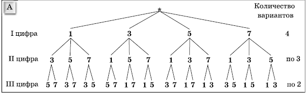

# Алгоритмы и структуры данных (ADS-10)


Срок выполнения задания:

**до 05 июня** 


## Задание

> Разработать версию дерева вариантов (возможностей) для генерации всех перестановок заданного набора символов (элементов типа **char**)

## Пояснение

Одной из задач комбинаторики является генерация всех перестановок элементов. Возьмем, к примеру, цифры 1,2,3. Из этих цифр можно образовать следующие последовательности:

```
123
132
213
231
312
321
```

В качестве решения задачи генерации всех перестановок можно использовать **дерево вариантов**.

Рассмотрим пример с генерацией всех перестановок из множества цифр 1,3,5,7 (см. рис.)



На первом уровне используются цифры 1,3,5,7. Количество узлов в дереве на этом уровне соответствует количеству цифр, то есть 4. 
От каждого узла вниз отходят по три связи к узлам, в которых находятся оставшиеся цифры в множестве (например 3,5,7 для 1). Передвигаясь на уровень ниже мы можем использовать цифры, которые не встречаются на пути от корня. На уровне три мы можем организовать не более двух связей для каждого узла.

Если опуститься еще на один уровень, то связей будет по одной. Так, от цифры 5 мы можем образовать потомка с 7, а от 7 - 5.

Таким образом, по мере построения дерева, мы будем уменьшать количество связей, идущих от родительского узла. При добавлении новых узлов, значения в них должны располагаться по возрастанию. 

Если двигаться от корня к листьям, мы будем получать возможные комбинации. Эти комбинации должны приводить к получению упорядоченных по возрастанию "чисел", например:

```
1357
1375
1537
1573
...
```

## Алгоритм построения дерева

Перед началом необходимо разработать узел дерева, в котором будет находиться вектор из указателей на узлы нижнего уровня. 

1. Вызываем первый раз функцию построения дерева с вектором из исходных элементов (например, 1,3,5,7).
1. Для корня дерева образуем потомков по числу цифр в векторе (например, как на рисунке четыре).
1. Вызываем функцию построения дерева рекурсивно и передаем ей вектор из оставшихся цифр. То есть, для узла с 1 массив должен содержать 3,5,7. 
1. Образуем потомков и присваиваем им значения из вектора.
1. Рекурсивно для каждого потомка передаем вектор из двух элементов.
1. Рекурсия должна остановится, когда передаваемый вектор будет пустой.

## Алгоритм получения перестановок

Для получения перестановок необходимо сделать проход по дереву, начиная с корня и выдавая элементы, хранящиеся в узлах. Обход должен начинаться с левых значений и постепенно двигаться к правым. Выдаваемые значения должны соответствовать данным, упорядоченным по возрастанию. Все полученные перестановки размещаются в векторе.

## Функция получения перестановки с номером

Необходимо разработать функцию, которая получает из дерева перестановку с определенным номером. например, для рассмотренного случая с цифрами 1,3,5,7, перестановка №1 должна соответствовать строке "1357", а перестановка №2 - "1375". Реализовать такую функцию можно двумя способами:

- предварительным получением всех перестановок с сохранением их в векторе. 

Данное решение увеличит скорость работы, поскольку запросить множество перестановок придется один раз, а потом функция будет просто выдавать значения из вектора. Но при этом придется хранить все возможные перестановки в векторе (расход памяти).

- обращением за перестановкой к дереву, с передачей ему номера требуемой перестановки

Затраты памяти при этом подходе несущественны, зато скорость операции будет снижаться при увеличении номера перестановки.

Функция должна получить вектор из элементов, образующих перестановку. 


## Пример использования дерева

```cpp

// определяем входной вектор для дерева
std::vector<char> in = {'1','2','3'};

// создаем дерево
Tree tree(in);

// запрашиваем первую перестановку
std::vector<char> result1 = getPerm(tree, 1);  //  123

// запрашиваем вторую перестановку
std::vector<char> result2 = getPerm(tree, 2);  //  132

...
```

**Примечание** 

Если перестановки с указанным номером не существует, то должен возвращаться пустой вектор.

## Состав проекта

В файл **include/tree.h** необходимо поместить описание дерева **Tree** с основными функциями. Класс **Tree** реализуется для элементов типа **char**.

В файл **src/alg.cpp** поместить реализацию функции `std::vector<char> getPerm(const Tree& tree, int n)`, возвращающую перестановку с номером **n** в виде вектора их символов.

Файл **src/main.cpp** должен содержать примеры получения перестановок.


